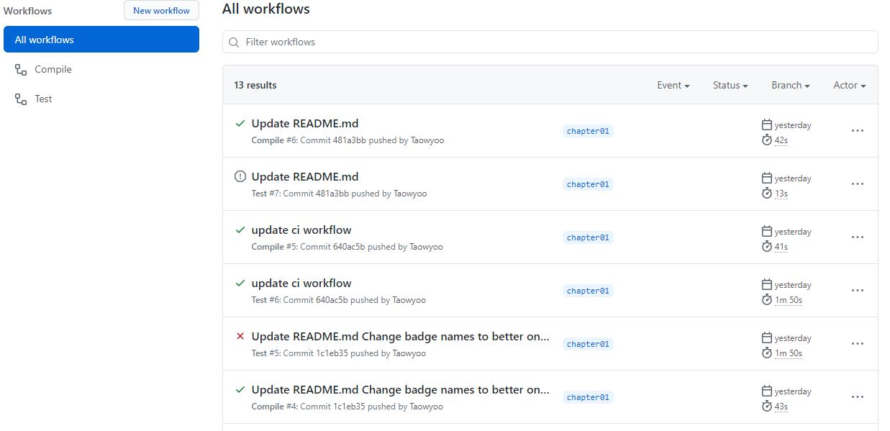

# Gateway Device Application (Connected Devices)

## Lab Module 01

<!-- Be sure to implement all the PIOT-GDA-* issues (requirements) listed at [PIOT-INF-01-001 - Chapter 01](https://github.com/orgs/programming-the-iot/projects/1#column-9974937). -->

### Description

<!-- NOTE: Include two full paragraphs describing your implementation approach by answering the questions listed below. -->

What does your implementation do?

1. Development environment configuration
    
    I choose idea for developing. I installed the latest OpenJDK 14 on my computer and setup environment path for java. After run common unit test and integration test for part01 successfully, all things done.

2. Set CI/CD for auto testing
   
    I used GitHub Action to implement the CI/CD. I created `.yml` files under `.github/workflows/` to let github auto run some auto task to test my GDA.

    I setup two scripts. One for testing compile: [Compile workflow file](../../.github/workflows/maven2.yml)

    Another for running tests for part01: [Test workflow file](../../.github/workflows/maven.yml)

3. Create a kanban board for project for workflow with GitHub project
   
    It's very easy, it is almost very similar to given kanban board of our whole course.
    It was called [Course Project - CDA](https://github.com/NU-CSYE6530-Fall2020/constrained-device-app-Taowyoo/projects/1).

How does your implementation work?

1. CI/CD with Github Action
   
    As mentioned above. The `.yml` files under `.github/workflows/` will be read by Github and running tasks automatically when I push or pull request to specific branch. At current, I set it will be triggered on `chapter01`

    For example there is a new commit I pushed to GitHub:

    1. According to [Compile workflow file](../../.github/workflows/maven2.yml), Github will setup a container with JDK 11.
    2. Pull the codes with pushed commit.
    3. run `mvn -B test-compile --file pom.xml` to test whether project can be compiled successfully.
    4. According to another [Test workflow file](../../.github/workflows/maven.yml)
    5. Github will setup a container which similar to step 1,2
    6. Then run `mvn -B clean test -Dtest=programmingtheiot.part01.unit.common.ConfigUtilTest -Dtest=programmingtheiot.part01.integration.app.GatewayDeviceAppTest` to build and run tests only for part01.
    
    Here is example screen shot:
    

    For future parts and new codes. I will update these yml files to fit to project needs, such as test part02 part 03 or run packaging and publish jar to Github Release and deploy it to my cloud to complete a full CD/CD lifecycle.

2. Create a kanban board for project for workflow with GitHub project

    I will write all my tasks, subtasks, future features, documents update on it to arrange my develop plan for GDA.
    1. At first for a new task, it will be created as a issue in the column in ToDo.
    2. Then when I finish coding and commit or pull request. it will turn into In progress.
    3. After code being merged into main branch. It will turn to Done.
    4. Also, I also will write some note that's important to me in Note column.
    

### Code Repository and Branch

<!-- NOTE: Be sure to include the branch (e.g. https://github.com/programming-the-iot/python-components/tree/alpha001). -->

URL: https://github.com/NU-CSYE6530-Fall2020/gateway-device-app-Taowyoo/tree/chapter01

### UML Design Diagram(s)

<!-- NOTE: Include one or more UML designs representing your solution. It's expected each
diagram you provide will look similar to, but not the same as, its counterpart in the
book [Programming the IoT](https://learning.oreilly.com/library/view/programming-the-internet/9781492081401/). -->

For fist chapter, I did not write any new code. But here is the current class diagram for DeviceDataManager and GatewayDeviceApp, which will help myself for further development:

### Unit Tests Executed

<!-- NOTE: TA's will execute your unit tests. You only need to list each test case below
(e.g. ConfigUtilTest, DataUtilTest, etc). Be sure to include all previous tests, too,
since you need to ensure you haven't introduced regressions. -->

- programmingtheiot.part01.unit.common.ConfigUtilTest

### Integration Tests Executed

<!-- NOTE: TA's will execute most of your integration tests using their own environment, with
some exceptions (such as your cloud connectivity tests). In such cases, they'll review
your code to ensure it's correct. As for the tests you execute, you only need to list each
test case below (e.g. SensorSimAdapterManagerTest, DeviceDataManagerTest, etc.) -->

- programmingtheiot.part01.integration.app.GatewayDeviceAppTest
